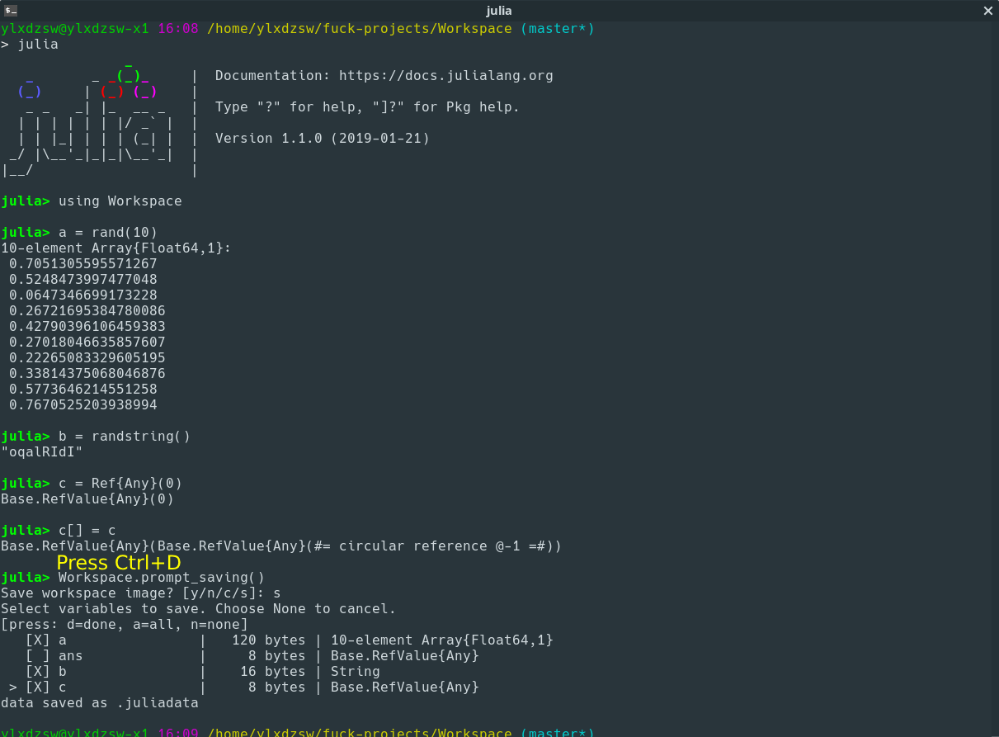

Workspace
=========

A missing feature of Julia that prompts you to save your work when you press Ctrl+D like R.

### Installation

```julia
]add https://github.com/ylxdzsw/Workspace.jl
```

### Usage

```julia
using Workspace
```

When you press Ctrl+D, you will be asked to save your work. Press "y" to save all global variables, "n" to close without
saving, "c" to cancel, and "s" to review and select variables to save.

You can read the saved variables back using JLD2:

```
using JLD2
@load ".juliadata"
```

### ScreenShot

